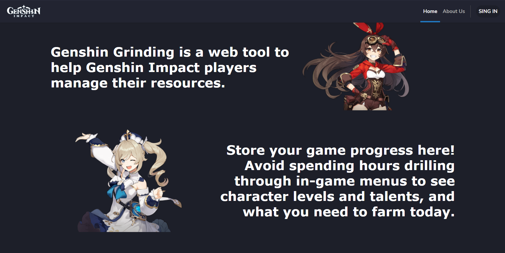

  

---

<h1 align="center">
Genshin Grinding
</h1>

<h2 align="center">
  Planeje seu farm em Genshin Impact
</h2>

  
  
  
  

  <a href="#projeto">Projeto</a>
  &nbsp;&nbsp;|&nbsp;&nbsp;
  <a href="#tecnologias">Tecnologias</a>
  &nbsp;&nbsp;|&nbsp;&nbsp;
  <a href="#como-executar">Como executar</a>
  &nbsp;&nbsp;|&nbsp;&nbsp;
  <a href="#licença">Licença</a>

# Projeto

  

Genshin Grinding é uma aplicação web com o objetivo de auxiliar os jogadores de Genshin Impact, ARPG chinês da empresa Mihoyo, a planejarem o fortalecimento de seus personagens e otimizar o uso de seus recursos do jogo.

Através do frontend web, os players podem se cadastrar, e então adicionar itens e personagens que possui no jogo. A tarefa do site é informá-lo o quanto já tem e de quanto mais precisa para elevar seus personangens até o nivel máximo.

# Tecnologias

Este projeto foi desenvolvido utilizando as seguintes tecnologias:

- [Node.js](https://nodejs.org/)
- [React](https://reactjs.org)
- [TypeORM](https://typeorm.io/#/)
- [Express](https://expressjs.com/pt-br/)

# Como executar

### Requisitos

- [Node.js](https://nodejs.org/)
- [React](https://reactjs.org)
- [npm](https://npmjs.com/)

## Backend

- Estando na pasta raíz do projeto, navegue para o diretório do servidor com `cd backend`.
- Instale as dependências usando `npm install`.
- Crie um arquivo `.env` na raiz da pasta e configure as variáveis de ambiente presentes no arquivo `.env.example`
- Realize as migrações do banco de dados com o comando `npm run typeorm migration:run`
- Execute o servidor usando `npm start`.

## Frontend

- Estando na pasta raíz do projeto, navegue para o diretório do frontend com `cd web`.
- Instale as dependências usando `npm install`.
- Execute o dev server usando `npm start`.

# Licença

Esse projeto está sob a licença MIT. Veja o arquivo [LICENSE](LICENSE) para mais detalhes.
